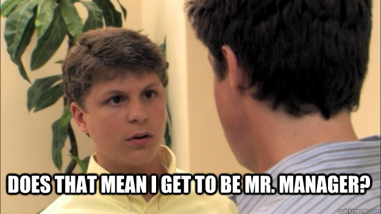

# Nicolai Gjellestad

### Lyll and Nicode

<!---
. Welcome to my talk about what 1 experienced when I gradually, but suddenly became a leader. 
- This talk is about my path into leadership roles
- I don't have any formal leadership training
- Lessons I have learned and mistakes I've made
- What I have discovered to be important in leadership
- I'm Nicolai, married, two children and a cat
- Developer based in Bergen
- CTO in Lyll, which is a digital marketing startup
- Consultant at Nicode, which is my own company
--->

---

<!---
- Landed my dream job in 2019
- Finally a proper developer, until this point I worked with IT services and then some white collar consulting
- I don't know why I felt that I was less of a person because I wasn't a developer
- Looking forward to spending all my time with development
- Being one of the cool guys
--->

---

<!---
- This is a portrait of me in 2019
- I was happy and enthusiastic about my new job
- I was a sponge to new tasks and responsibilities
- Saying yes to everything
- People didn't even have to ask me to do stuff, I did what I thought was necessary
- Gradually I became tech lead or even de-facto CTO and I loved it
- I felt important
--->

---

<!---
- This is a portrait of me in the end of 2020
- I was at this point not productive at all
- Trying to do everything, accomplishing nothing
- It cost me my sleep, health
- Ended up crying in a doctors office
--->

---

# Post-mortem time :thinking:
### Where did I go wrong? 
<!---
- What happened between me being super enthusiastic and then broken
- I didn't say no, I was too enthusiastic
- I didn't know my limitations
- I took on too much tasks and responsibilities
- Tried to do all tasks as a developer in addition to new roles
- The only person thinking about your well being is yourself
- My identity and capabilities wasn't aligned with the expectations, responsibilities and compensation
--->

---

# Identity
## The hardest part to shift
<!---
- My identity was still a developer
- What I should have done was to reckognize that my role was shifting, and my identity was stuck
- When you have a gradual shift towards leadership, it's hard for the identity to follow
- It's better to not have a fixed identity
- Instead of: I'm a developer / designer / DevOps
- Use: I'm a problem solver / team member
- A flexible identity is easier to shift
--->

---
# Expectations
### The power of a no
<!---
- Be quick to say no
- Take a long time to say yes
- Saying yes all the times increase expectations to say yes the next time
- Be sure that you can deliver on the expectations
--->

---
# Responsibilities
### Prioritize
<!---
- In a leading role no one usually tells you in detail how to spend your day
- You cannot do everything, so you have to prioritize
- Be sure that this is the right thing to do
- Decide what not to do. Should it be done or delegated? 
--->
---
# Compensation

<!---
- A developer becoming a CTO is a cheap CTO
- Companies love when they get more work for the money
- No one is giving you a raise unless you negotiate
- It can hurt when you sacrifice a lot for the company and get nothing in return but empty promises
- It's hard to negotiate salary increase when leadership is small increments
- Have continuous communication about your responsibilities
- Have clear agreements on when and how compensation should be adjusted
- Be clear about your expectations
--->

--- 

# Ideal situation
### Identity = Responsibilities = Expectations = Compensation

<!---
- The ideal situation is when everything is aligned
- Your identity fits the responsibilities
- The responsibilities fits the expectations
- The expectations fits the compensation
- There is no strain
--->

---
# Be a better leader
### Focus
<!---
- Focus on the well-being and sucess of your team
- Your team is now your task
- Focus on serving them before other tasks and requests
- See things from a larger perspective and time frame
- Example: You are not doing the right thing if you try to solve a bug by yourself instead of helping the entire team 
--->

---
# Be a better leader
### Outcome, not output
<!---
- Focus on the outcome, not the output of the team
- Output is short perspective, and the result of your work
- Outcome is long perspective, and the impact of your work
- Impact on the customers and users, are what you are producing to the better for them?
- Impact on the team and business, are we working in a sustainable way and is this the best for the company?
--->